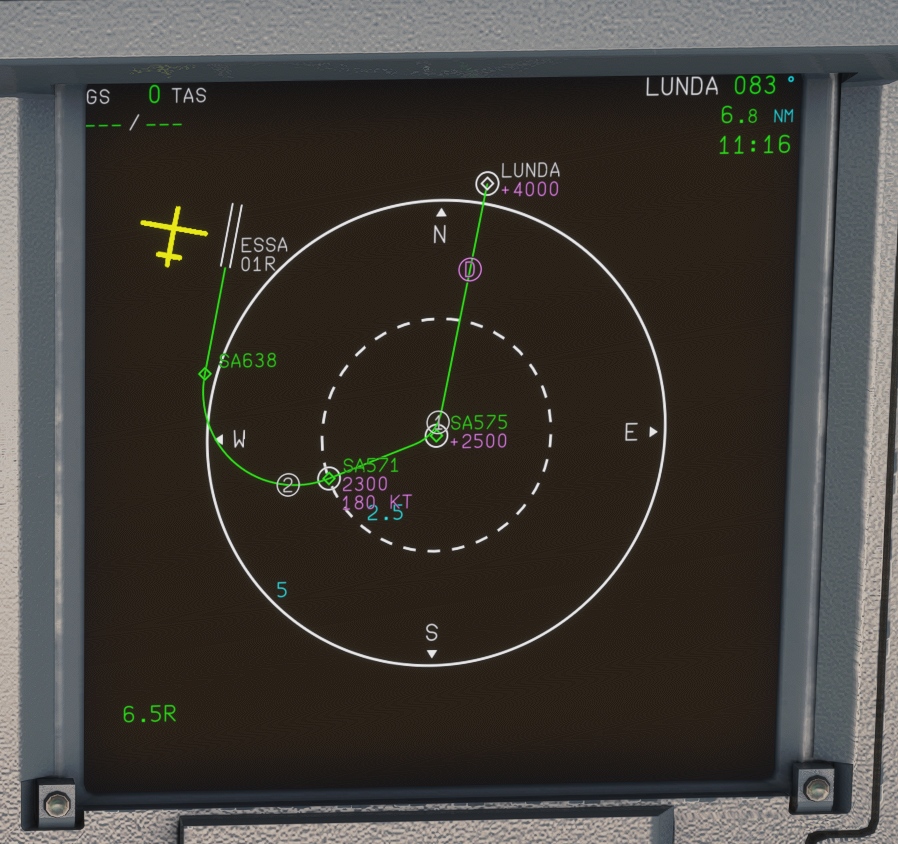

# ESSA custom curved RNP procedures
Some custom curved RNP procedures with RF-legs used in research project PJ.02-W2-04.1/2/3. The procedures are used in an environment with fictive airspace definition around ESSA airport to study curved approach operation, and not in real operations.

The procedures use RF-leg and therefore an aircraft with capable FMS is required for expected behaviour such as the FBW A32NX [^1] .

[^1]: At the time of writing only the development and experimental versions with the custom Flight Plan Manager can properly fly RF-legs.

---
### Installation 
> Download folder *liljeroth-essa-custom-approaches* and put in MSFS 2020 Community folder. If Navigraph is used, then Navigraph must be installed **first** and MSFS started once before adding *liljeroth-essa-custom-approaches* to Community folder.
---

Currently two procedures are coded:
1. RNP E 01L  - Curved approach to 01L from west
2. RNP L 01R - Curved approach to 01R from North-East

RNP E 01L             |  RNP L 01R
:-------------------------:|:-------------------------:
! |   

